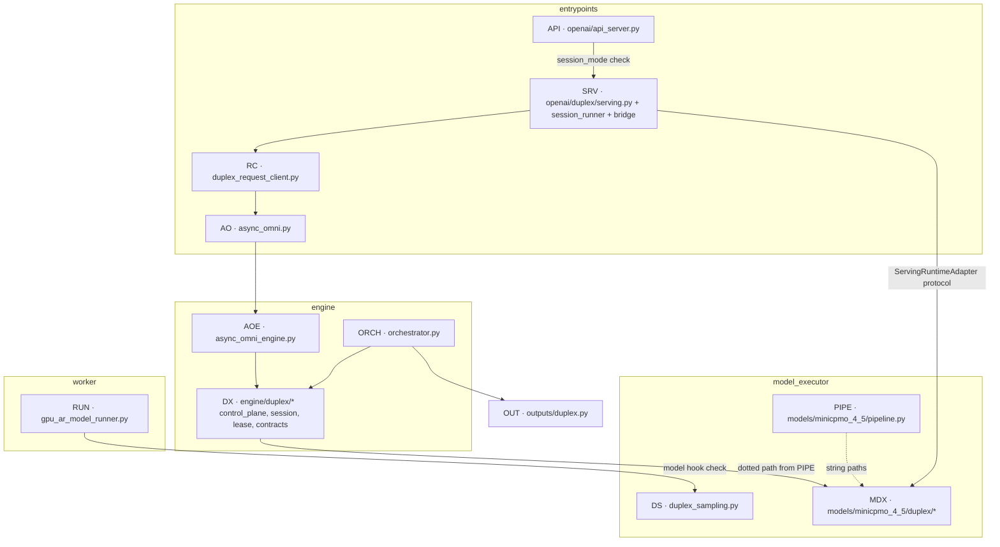
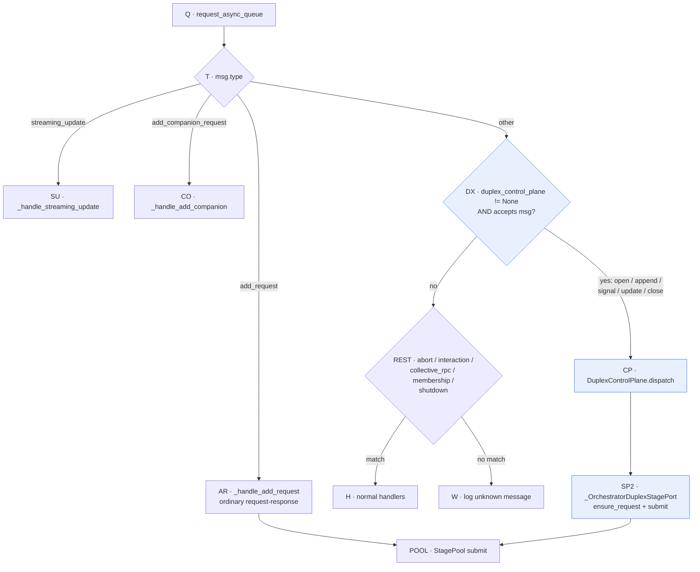
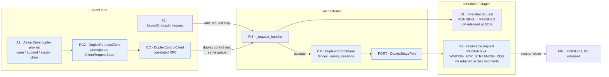
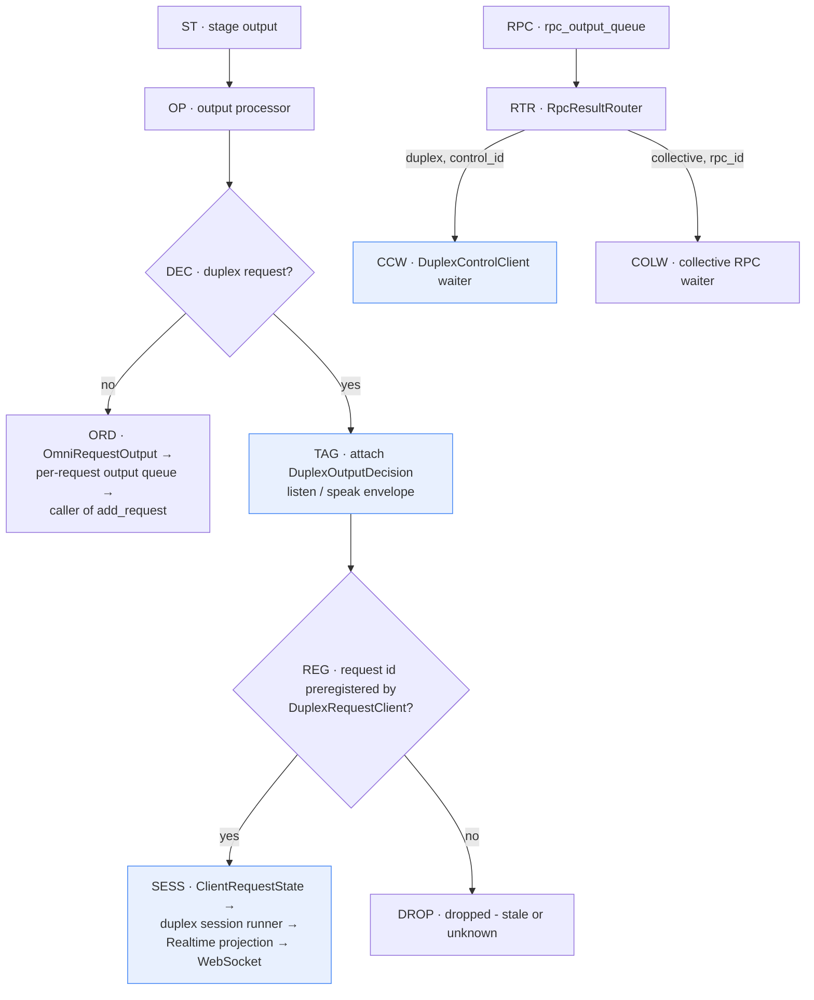

# Full-Duplex Graduation: Moving `experimental/fullduplex` into the Stable Tree

Mission: move all full-duplex code out of `vllm_omni/experimental/fullduplex/`
into the regular (non-experimental) packages. `joyvl/` is out of scope and
stays where it is, together with the `core/` scaffold it depends on.

Decisions already made:

- Model adapter code goes to `vllm_omni/model_executor/models/minicpmo_4_5/duplex/`.
- Clean break: no compat shims at the old import paths; update all in-repo references.
- Tests are relocated to mirror the new layout in the same effort.
- New subpackages are named `duplex` (matches `DuplexSession`, `DuplexControlPlane`,
  `duplex_control_enabled`, and the RFC's `serving_duplex` naming).

## 1. Current state

- ~17k lines in `vllm_omni/experimental/fullduplex/`:
  - `engine/` — control plane, session transactions, leases, contracts, messages.
  - `openai/` — WebSocket actor, Realtime projection, serving handler (largest part).
  - `minicpmo45/` — MiniCPM-o 4.5 model adapter (policy, stage0, data plane).
  - `core/` — small generic scaffold; used only by `joyvl/` → stays.
  - Top-level: `client.py` (demo WS client), `request_client.py`,
    `output.py`, `model_executor.py`.
- Stable modules (`engine/orchestrator.py`, `engine/async_omni_engine.py`,
  `entrypoints/async_omni.py`, `entrypoints/openai/api_server.py`,
  `worker/gpu_ar_model_runner.py`, `model_executor/stage_input_processors/minicpmo_4_5_omni.py`)
  already import the duplex modules **lazily**, inside duplex-only call paths.
- Exception: the MiniCPM model files (`minicpmo_4_5_omni.py`,
  `minicpmo_4_5_omni_tts.py`) import duplex modules **eagerly** at module
  level (`MiniCPMO45DuplexPolicy`, `DuplexSamplingRow`, `get_tts_handoff`).
  Acceptable — those files load only when the MiniCPM model is served — but
  it means the moved `duplex_sampling.py` and `engine/duplex/intermediate.py`
  load with the model even in non-duplex chat mode. Keep as-is.
- `models/minicpmo_4_5/pipeline.py` selects the runtime extension and serving
  adapter via **dotted string paths** pointing at the experimental package.
- CI path filters (`.buildkite/cuda/test-ready.yml`, `test-merge.yml`) and one
  demo (`examples/online_serving/minicpmo/realtime_duplex_demo.py`) reference
  the experimental path.

## 2. Target layout

Origin paths (`← ...`) are relative to `vllm_omni/experimental/fullduplex/`.

```text
vllm_omni/
├── engine/
│   └── duplex/                      # NEW
│       ├── __init__.py              # ← engine/__init__.py (docstring only)
│       ├── contracts.py             # ← engine/contracts.py — immutable DTOs, extension/stage protocols
│       ├── messages.py              # ← engine/messages.py — DuplexFence, control envelopes
│       ├── lease.py                 # ← engine/lease.py — lease activity, TTL/grace, expiry
│       ├── session.py               # ← engine/duplex_session.py — fences, reservations
│       ├── control_plane.py         # ← engine/duplex_control_plane.py
│       ├── control_client.py        # ← engine/duplex_control_client.py
│       ├── runtime.py               # ← engine/duplex_runtime.py — extension load/validate
│       └── intermediate.py          # ← engine/intermediate.py — stage-transfer schema
│
├── outputs/
│   └── duplex.py                    # ← output.py — attach/get DuplexOutputDecision
│
├── model_executor/
│   ├── duplex_sampling.py           # ← model_executor.py — DuplexSamplingHelper/Row for AR runner hook
│   └── models/minicpmo_4_5/
│       └── duplex/                  # NEW
│           ├── __init__.py          # ← minicpmo45/__init__.py (keep 5 re-exports)
│           ├── adapter.py           # ← minicpmo45/adapter.py — MiniCPMO45NativeDuplexServingAdapter
│           ├── policy.py            # ← minicpmo45/policy.py — listen/speak token policy
│           ├── input.py             # ← minicpmo45/input.py — PCM framing, ref-audio decode
│           ├── session.py           # ← minicpmo45/session.py — MiniCPMO45ServingSessionState
│           ├── serving_adapter.py   # ← minicpmo45/serving_adapter.py — MiniCPMO45ServingRuntimeAdapter
│           ├── data_plane.py        # ← minicpmo45/data_plane.py — data-plane projection
│           ├── stage0.py            # ← minicpmo45/stage0.py — Stage0 conversation state
│           ├── runtime.py           # ← minicpmo45/runtime.py — MiniCPMO45DuplexRuntimeExtension
│           └── compat.py            # ← minicpmo45/compat.py — HF remote-config patching
│
├── entrypoints/
│   ├── duplex_request_client.py     # ← request_client.py — beside client_request_state.py it uses
│   └── openai/
│       └── duplex/                  # NEW
│           ├── __init__.py          # ← openai/__init__.py (keep DuplexWebSocketActor re-export; must NOT import client.py)
│           ├── serving.py           # ← openai/serving.py — OmniDuplexSessionHandler
│           ├── session_runner.py    # ← openai/session_runner.py — DuplexSessionRunnerMixin, actor loop
│           ├── runtime_bridge.py    # ← openai/runtime_bridge.py — NativeRuntimeBridgeMixin
│           ├── runtime_adapter.py   # ← openai/runtime_adapter.py — model-neutral ServingRuntimeAdapter protocol
│           ├── session_attachment.py# ← openai/session_attachment.py — resume/takeover registry
│           ├── websocket.py         # ← openai/websocket.py — DuplexWebSocketActor (mailbox + writer)
│           ├── protocol.py          # ← openai/protocol.py — DuplexSession aggregate + wire types
│           ├── realtime_session.py  # ← openai/realtime_session.py — NativeRealtimeSessionProtocol
│           ├── realtime_input.py    # ← openai/realtime_input.py
│           ├── realtime_output.py   # ← openai/realtime_output.py
│           ├── realtime_state.py    # ← openai/realtime_state.py
│           ├── audio.py             # ← openai/audio.py — PCM/WAV codecs
│           ├── chat_fallback.py     # ← openai/chat_fallback.py
│           ├── commit_policy.py     # ← openai/commit_policy.py
│           └── client.py            # ← client.py (top level) — demo/e2e WS client
│
└── experimental/
    └── fullduplex/                  # REMAINS: joyvl only
        ├── README.md                # trimmed to joyvl scope
        ├── __init__.py              # core re-exports (unchanged, joyvl compat)
        ├── core/                    # stays — joyvl depends on it
        └── joyvl/                   # untouched
```

File count check: the experimental package (excluding `core/`, `joyvl/`,
`README.md`, `DESIGN.md`, and the top-level `__init__.py`) holds
9 engine + 15 openai + 10 minicpmo45 + 4 top-level modules = 38 files;
every one is mapped above. The top-level `__init__.py` stays behind — its
`core` re-exports are joyvl-scope; `DESIGN.md` → `docs/design/fullduplex.md`.

- `DESIGN.md` moves to `docs/design/fullduplex.md` (`docs/design/` already
  exists), with module paths updated.
- Package `__init__.py` re-exports must carry over verbatim: the minicpmo45
  package re-exports 5 symbols (`MiniCPMO45DuplexPolicy`,
  `MiniCPMO45NativeDuplexServingAdapter`, `MiniCPMO45ClientRuntimeConfigError`,
  `MiniCPMO45PcmAppendBuffer`, `MiniCPMO45Stage0DuplexRuntime`) that
  `tests/entrypoints/openai_api/test_duplex_handler.py` imports at package
  level; the openai package re-exports `DuplexWebSocketActor`.
- The new `entrypoints/openai/duplex/__init__.py` must **not** import
  `client.py`: it raises `SystemExit` at import time when the optional
  `websockets` dependency is missing (it is a demo/e2e helper only).
- Packaging needs no change: `pyproject.toml` uses
  `include = ["vllm_omni*"]`, which covers the new subpackages.

## 3. Layering after the move



Decision annotations (gated edges — this graph has no diamond nodes; the
decisions live on the gated/string edges). Imports along these edges are
top-level (eager); the gates decide runtime behavior, not module loading.
`vllm/...` paths are the external vLLM checkout.

| Edge | Decision | Source |
| --- | --- | --- |
| `API → SRV` (session_mode check) | is the duplex endpoint enabled for this deployment? | `vllm_omni/entrypoints/openai/api_server.py` — `omni_init_app_state()` (gate + handler construction); predicate `vllm_omni/entrypoints/openai/duplex_capability.py` — `should_enable_duplex_endpoint()` |
| `ORCH → DX` | `enable_duplex_control` set? | `vllm_omni/engine/orchestrator.py` — `Orchestrator.__init__()` (plane construction) |
| `AOE → DX` | duplex runtime/control requested? | `vllm_omni/engine/async_omni_engine.py` — `AsyncOmniEngine._run_orchestrator()` (runtime), `AsyncOmniEngine._get_duplex_control_client()` (control client) |
| `RUN → DS` (model hook check) | does the model expose `prepare_duplex_sampling`? | `vllm_omni/worker/gpu_ar_model_runner.py` — `_resolve_duplex_sampling_hook()` |
| `PIPE ⇢ MDX` (string paths) | dotted-path plugin selection, resolved at runtime | `vllm_omni/model_executor/models/minicpmo_4_5/pipeline.py` — `MINICPMO_4_5_PIPELINE` config (`duplex_runtime_extension` / `duplex_serving_adapter` fields) |

- Import rules (revised 2026-08-03 — eager-import follow-up):
  - The in-repo duplex kernel and serving modules are imported **eagerly**:
    `orchestrator.py`, `async_omni_engine.py`, `async_omni.py`,
    `api_server.py`, and `gpu_ar_model_runner.py` import their duplex
    dependencies at the top of the file. Duplex behavior remains opt-in via
    the `enable_duplex_control` / capability gates; only module loading
    changed.
  - Two imports stay dynamic by necessity: model adapters load via the
    dotted-string plugin paths (config decides which module), and
    `entrypoints/openai/duplex/client.py` (websockets demo helper that
    raises `SystemExit` when `websockets` is missing) is never imported by
    runtime code.
  - Generic serving (`serving.py`, `runtime_bridge.py`, `session_runner.py`)
    must not import MiniCPM modules; the model is selected only via
    `PipelineConfig.duplex_serving_adapter` / `duplex_runtime_extension`
    string paths. Import-boundary tests keep enforcing this.
  - `models/minicpmo_4_5/duplex/` importing the `ServingRuntimeAdapter`
    protocol from `entrypoints/openai/duplex/runtime_adapter.py` is the
    normal plugin-implements-host-interface direction and stays.

## 4. Active runtime path (unchanged behavior, new module homes)

```mermaid
flowchart LR
    WS[WS · WebSocket] --> H[H · entrypoints/openai/duplex/serving.py<br/>OmniDuplexSessionHandler]
    H --> S[S · protocol.py DuplexSession<br/>+ minicpmo_4_5/duplex/session.py]
    S --> RC[RC · entrypoints/duplex_request_client.py]
    RC --> AO[AO · entrypoints/async_omni.py<br/>open/append/signal/close proxies]
    AO --> CC[CC · engine/duplex/control_client.py]
    CC --> CP[CP · engine/duplex/control_plane.py<br/>+ engine/duplex/session.py]
    CP --> EXT[EXT · minicpmo_4_5/duplex/runtime.py<br/>DuplexRuntimeExtension]
    EXT --> SP[SP · StagePool → resumable scheduler request]
    SP --> ST0[ST0 · MiniCPM Stage0] --> ST1[ST1 · Stage1 TTS / Token2Wav]
    ST1 --> OP[OP · output processor + outputs/duplex.py]
    OP --> RT[RT · realtime_output.py projection] --> WS
```



Decision annotations — this path is linear; the only decision sits before the
first box (which WebSocket connections enter the duplex path at all):

| Node / edge | Decision | Source |
| --- | --- | --- |
| `WS → H` | `/v1/realtime` with query `duplex` = `1` / `true` / `on` → duplex projection | `vllm_omni/entrypoints/openai/api_server.py` — `realtime_websocket()` |
| `WS → H` | native `/v1/duplex` endpoint (handler present, else error frame) | `vllm_omni/entrypoints/openai/api_server.py` — `duplex_websocket()` |

Every hop after `H` (`OmniDuplexSessionHandler`,
`entrypoints/openai/duplex/serving.py`) is an unconditional call chain; the
output-side branching of `OP`/`RT` is annotated in §9.3.

## 5. Reference-update matrix

| File | Change |
| --- | --- |
| `engine/orchestrator.py` | duplex imports (top-level since 2026-08-03) → `vllm_omni.engine.duplex.{contracts,session,messages,control_plane,lease}`; `vllm_omni.outputs.duplex` |
| `engine/async_omni_engine.py` | duplex imports (top-level) → `vllm_omni.engine.duplex.{control_client,lease,messages,runtime}` |
| `entrypoints/async_omni.py` | duplex imports (top-level) → `vllm_omni.entrypoints.duplex_request_client`, `vllm_omni.engine.duplex.{lease,messages}` |
| `entrypoints/openai/api_server.py` | duplex handler import (top-level) → `vllm_omni.entrypoints.openai.duplex.serving` |
| `worker/gpu_ar_model_runner.py` | duplex import (top-level) → `vllm_omni.model_executor.duplex_sampling` |
| `model_executor/stage_input_processors/minicpmo_4_5_omni.py` | → `vllm_omni.engine.duplex.intermediate`, `...models.minicpmo_4_5.duplex.input` |
| `model_executor/models/minicpmo_4_5/pipeline.py` | dotted strings → `vllm_omni.model_executor.models.minicpmo_4_5.duplex.runtime.MiniCPMO45DuplexRuntimeExtension`, `...duplex.serving_adapter.MiniCPMO45ServingRuntimeAdapter` |
| `model_executor/models/minicpmo_4_5/*.py` (3 model files) | import path updates |
| `examples/online_serving/minicpmo/realtime_duplex_demo.py` | → `vllm_omni.entrypoints.openai.duplex.client` |
| `tests/e2e/online_serving/minicpmo_realtime_duplex_scenarios.py` | → `vllm_omni.entrypoints.openai.duplex.client` |
| `.buildkite/cuda/test-ready.yml`, `test-merge.yml` | in the "MiniCPM-o 4.5 Duplex Test" blocks, replace `vllm_omni/experimental/fullduplex/` with 3 dirs (`engine/duplex/`, `entrypoints/openai/duplex/`, `model_executor/models/minicpmo_4_5/duplex/`) + 3 files (`outputs/duplex.py`, `entrypoints/duplex_request_client.py`, `model_executor/duplex_sampling.py`) + new test dirs |
| `pyproject.toml` | lint-ignore line is joyvl-only → unchanged |
| `experimental/fullduplex/README.md` | trim to joyvl/core scope |
| `DESIGN.md` | relocate, update module tables (kernel/experimental split section rewritten as kernel/duplex split) |

## 6. Test relocation

| From `tests/e2e/features/fullduplex/` | To |
| --- | --- |
| `engine/` — 6 files: `test_duplex_control_client.py`, `test_duplex_control_plane.py`, `test_duplex_deploy_config.py`, `test_duplex_intermediate.py`, `test_duplex_lease.py`, `test_duplex_runtime.py` | `tests/engine/duplex/` |
| `openai/` — 3 files: `test_duplex_audio.py`, `test_websocket_actor.py`, `test_runtime_adapter_boundary.py` | `tests/entrypoints/openai/duplex/` |
| `minicpmo45/` — 2 files: `test_commit_policy.py`, `test_input.py` | `tests/model_executor/models/minicpmo_4_5/duplex/` |
| `test_client.py` | `tests/entrypoints/openai/duplex/` |
| `test_runtime.py` (covers `core/` + joyvl adapter), `test_joyvl_*.py` | stay (joyvl/core scope) |

- Tests already in stable locations (`tests/engine/test_duplex_import_boundary.py`,
  `tests/entrypoints/...`, `tests/worker/test_native_duplex_hooks.py`,
  `tests/e2e/online_serving/test_minicpmo_4_5_duplex.py`) only get import updates.
- `test_duplex_import_boundary.py` (revised 2026-08-03 with the eager-import
  follow-up) asserts that importing `Orchestrator` / `AsyncOmniEngine` /
  `AsyncOmni` loads the duplex kernel eagerly, while
  `vllm_omni.model_executor.models.minicpmo_4_5.duplex` and
  `vllm_omni.entrypoints.openai.duplex.client` are still **not** loaded
  (plugin-only / demo-only).
- `__init__.py` convention per target: `tests/engine/` and
  `tests/model_executor/models/minicpmo_4_5/` use `__init__.py` → new `duplex/`
  subdirs get one; `tests/entrypoints/openai/` has none → follow suit.
- Fixture safety: only `tests/conftest.py` exists on the ancestry path (no
  conftest under `tests/e2e/` or `tests/e2e/features/`), so relocated tests
  lose no fixtures.
- **CI tier check** (verified during execution): the moved tests are marked
  `core_model and cpu`. After the move, engine + openai tests are picked up by
  the "Simple · Engine&Entrypoints Test" CPU block
  (`pytest tests/entrypoints tests/engine`), and the two minicpmo45 tests are
  picked up by the "Simple · Model Executor Test" CPU block
  (`pytest tests/model_executor`) that exists in both `test-ready.yml` and
  `test-merge.yml`. No CI command change is needed; confirm with
  `pytest --collect-only -m 'core_model and cpu'` on the three new dirs.
- `docs/contributing/ci/test_writing_guide.md` / `test_system_overview.md`
  cite `tests/e2e/features/fullduplex/` as a feature-dir example — still valid
  after the move (the dir survives holding joyvl tests); no doc change required.

## 7. Migration order (each step leaves the tree importable and testable)

1. **Engine kernel**: move `engine/` → `engine/duplex/` (with the
   `duplex_` prefix dropped from module names); move `output.py` →
   `outputs/duplex.py`; update `orchestrator.py`, `async_omni_engine.py`
   lazy imports; update engine tests.
2. **Entrypoint plumbing**: move `request_client.py` →
   `entrypoints/duplex_request_client.py`; `model_executor.py` →
   `model_executor/duplex_sampling.py`; update `async_omni.py`,
   `gpu_ar_model_runner.py`; update their tests.
3. **Serving stack**: move `openai/` → `entrypoints/openai/duplex/`
   (plus `client.py`); update `api_server.py` handler import and demo script;
   update serving/protocol/handler tests.
4. **Model adapter**: move `minicpmo45/` →
   `models/minicpmo_4_5/duplex/`; update `pipeline.py` dotted strings,
   `stage_input_processors/minicpmo_4_5_omni.py`, model files; update
   minicpmo tests and the import-boundary test.
5. **Cleanup**: relocate remaining tests, update `.buildkite` path filters,
   trim experimental `README.md`, relocate `DESIGN.md`, delete the emptied
   experimental modules; grep-verify no `experimental.fullduplex` reference
   remains outside `joyvl`/`core` and their docs/scripts.

## 8. Invariants that must survive the move

- Import boundary (revised 2026-08-03): the duplex kernel imports eagerly
  with the stable engine; model-specific duplex adapters load only via the
  dotted-string plugin paths, and the websockets demo client is never
  imported by runtime code
  (guarded by the updated import-boundary test).
- No behavior change: this is a pure relocation — no renamed public symbols,
  no logic edits, no new abstractions.
- `duplex_` prefix dropped only where the package name already carries it
  (`engine/duplex/session.py`, not `engine/duplex/duplex_session.py`);
  class names (`DuplexSession`, `DuplexControlPlane`, ...) are unchanged.
- Fence/lease/append transactional contracts, Realtime event contract, and
  the two-session admission behavior documented in `DESIGN.md` are untouched.
- `joyvl/` + `core/` remain importable at their current experimental paths.

## 9. Appendix: how the Orchestrator switches between request-response and full-duplex

- There is **one** Orchestrator, one request queue, and one stage machinery.
  Full-duplex is not a second pipeline — it is an optional control plane
  bolted onto the same intake loop and the same `StagePool`s.
- The switch happens at three places:
  1. **Construction** — `enable_duplex_control` (from
     `PipelineConfig.duplex_control_enabled`) decides whether a
     `DuplexControlPlane` exists at all. Ordinary deployments: `None`,
     single fast-path check.
  2. **Message intake** — `_request_handler()` reads one
     `request_async_queue`; duplex control envelopes are claimed by
     `duplex_control_plane.accepts(msg)` in the same `elif` chain that
     routes ordinary `add_request` / `streaming_update`.
  3. **Output tagging** — duplex outputs get a typed
     `DuplexOutputDecision` attached; client-side routing drops outputs
     that were not preregistered by `DuplexRequestClient`.

### 9.1 Message intake switch (`orchestrator._request_handler`)



Decision annotations:

| Node | Role / decision | Source |
| --- | --- | --- |
| `Q` | single intake queue read | `vllm_omni/engine/orchestrator.py` — `Orchestrator._request_handler()` |
| `T` | `msg.type` elif chain | `Orchestrator._request_handler()` |
| `AR` | ordinary add_request | `Orchestrator._handle_add_request()` |
| `SU` | streaming update | `Orchestrator._handle_streaming_update()` |
| `CO` | CFG companion | `Orchestrator._handle_add_companion()` |
| `DX` | `duplex_control_plane is not None and accepts(msg)` | branch in `Orchestrator._request_handler()`; predicate `vllm_omni/engine/duplex/control_plane.py` — `DuplexControlPlane.accepts()` (isinstance against the control-message types) |
| `CP` | dispatch (per-session ordered task) → typed handler fan-out | `DuplexControlPlane.dispatch()` → `handle()` → `handle_open()` / `handle_append()` / `handle_signal()` / `handle_close()` |
| `REST` | remaining stable handlers | `Orchestrator._handle_abort()` / `_handle_interaction()` / `_handle_collective_rpc()`; membership and shutdown branches inline in `_request_handler()` |
| `W` | unknown message warning | tail of `Orchestrator._request_handler()` |
| `SP2` | duplex stage port (ensure + submit) | `vllm_omni/engine/orchestrator.py` — `_OrchestratorDuplexStagePort.ensure_request()` / `.submit()` |
| `POOL` | shared StagePool submission | ordinary path `StagePool.submit_initial()` called from `Orchestrator._handle_add_request()`; the duplex port submits into the same `stage_pools` |

The construction-time switch that makes `DX` a one-check no-op for ordinary
deployments is the `enable_duplex_control` gate in `Orchestrator.__init__()`.

- Key point: when the deployment is ordinary, `duplex_control_plane is None`
  and the `accepts()` branch costs one `is not None` check — the duplex path
  is invisible.
- Both paths converge on the **same** `StagePool`; a duplex append becomes a
  *resumable* scheduler request instead of a one-shot one.

### 9.2 The two request lifecycles on shared stage machinery



Decision annotations:

| Node | Role / decision | Source |
| --- | --- | --- |
| `A1` | ordinary entry (`generate` → add_request message) | `vllm_omni/entrypoints/async_omni.py` — `AsyncOmni.generate()` → `engine.add_request_async()` |
| `A2` | duplex proxies | `AsyncOmni.open_duplex_session_async()` / `append_duplex_input_async()` / `signal_duplex_turn_async()` / `close_duplex_session_async()` |
| `RC2` | preregisters `ClientRequestState` for the fence-derived request id *before* submitting the append; rolls back on failure/mismatch | `vllm_omni/entrypoints/duplex_request_client.py` — `DuplexRequestClient.append()` |
| `CC` | correlated RPC: register waiter, submit, block on result | `vllm_omni/engine/duplex/control_client.py` — `DuplexControlClient.execute()` (waiter key `("duplex", control_id)`); result key `DuplexControlResultMessage.rpc_correlation_key` (`engine/duplex/messages.py`) |
| `RH` | same intake loop as §9.1 | `Orchestrator._request_handler()` (duplex branch via `accepts()`) |
| `CP` | fence/lease/session state machine | `vllm_omni/engine/duplex/control_plane.py` — `DuplexControlPlane`; fence accept `DuplexSessionRuntimeState.accept_fence()`, transactional append `prepare_append()`, stage-request reservation `reserve_stage_request()` (`engine/duplex/session.py`) |
| `PORT` | duplex → stage machinery bridge | `vllm_omni/engine/orchestrator.py` — `_OrchestratorDuplexStagePort.ensure_request()` / `.submit()` |
| `S1` | one-shot lifecycle | `Orchestrator._handle_add_request()` → `StagePool.submit_initial()`; runs to EOS under the vLLM scheduler (KV freed on finish) |
| `S2` | resumable lifecycle: parked as `WAITING_FOR_STREAMING_REQ`, woken by the next segment | status enum `vllm/v1/request.py` — `RequestStatus`; parked in vLLM `Scheduler._handle_stopped_request()` (`vllm/v1/core/sched/scheduler.py`); woken on streaming update by `OmniARScheduler._update_request_as_session()` and `OmniSchedulerMixin._replace_streaming_session()` (`vllm_omni/core/sched/`); orchestrator side `Orchestrator._handle_streaming_update()` → `StagePool.submit_update()` |
| `FIN` | session close or lease expiry | `DuplexControlPlane.handle_close()`; reaper `Orchestrator._duplex_reaper_loop()` → `DuplexControlPlane.reap_expired()` |

Barge-in (mentioned below) is `DuplexControlPlane.handle_signal()` →
`DuplexSessionRuntimeState.prepare_cancel_fence()` — a fence advance, not the
ordinary abort handler.

- Ordinary path: request enters, runs to EOS, KV freed — identity is the
  request.
- Duplex path: `open` reserves the Stage0 request resource transactionally;
  each `append` wakes the parked resumable request (prepare/submit/commit
  with fence validation); segment stop parks it again with KV retained;
  only `close` (or lease expiry via the reaper loop) finishes it — identity
  is the session.
- Cancellation (barge-in) does not use the ordinary `abort` handler: it is a
  duplex control message that advances the session fence atomically, so a
  stale append with the old fence is rejected forever.

### 9.3 Output-side routing



Decision annotations:

| Node | Role / decision | Source |
| --- | --- | --- |
| `ST → OP` | per-output routing entry | `vllm_omni/engine/orchestrator.py` — `Orchestrator._route_output()` |
| `DEC` | duplex request? (`None` fast path when no control plane / no duplex context) | `Orchestrator._duplex_output_decision()`; plane-side `DuplexControlPlane.decide_output()` (`engine/duplex/control_plane.py`, consults the runtime extension) |
| `ORD` | ordinary output flow | continues in `Orchestrator._route_output()`; client side `OmniBase._handle_output_message()` (`vllm_omni/entrypoints/omni_base.py`); per-request queue put in `AsyncOmni._final_output_handler()` |
| `TAG` | attach typed decision envelope | `Orchestrator._emit_duplex_direct_output()`; `attach_duplex_output_decision()` (`vllm_omni/outputs/duplex.py`) |
| `REG` | request id preregistered? | preregistration in `DuplexRequestClient.append()` (`vllm_omni/entrypoints/duplex_request_client.py`); lookup in `OmniBase._handle_output_message()` |
| `SESS` | registered → session runner → Realtime projection | `DuplexRequestClient.collect_registered_outputs()` / `collect_outputs()`; `DuplexSessionRunnerMixin` (`vllm_omni/entrypoints/openai/duplex/session_runner.py`); `RealtimeOutputProjector` (`vllm_omni/entrypoints/openai/duplex/realtime_output.py`) |
| `DROP` | unknown/stale request id dropped | unknown-request branch of `OmniBase._handle_output_message()` |
| `RPC` | shared RPC result queue | `vllm_omni/engine/async_omni_engine.py` — `AsyncOmniEngine.__init__()` (`rpc_output_queue`) |
| `RTR` | route by correlation key; late/unknown results dropped | `vllm_omni/engine/rpc_result_router.py` — `RpcResultRouter.register()` / `_run()` |
| `CCW` | duplex control waiter | key `("duplex", control_id)` — `DuplexControlClient.execute()`; result key `DuplexControlResultMessage.rpc_correlation_key` (`engine/duplex/messages.py`) |
| `COLW` | collective RPC waiter | key `("collective", rpc_id)` — `AsyncOmniEngine.collective_rpc()`; result key `CollectiveRPCResultMessage.rpc_correlation_key` (`engine/messages.py`) |

- Control results and data outputs travel on different channels: control
  acknowledgements come back through the single `RpcResultRouter` keyed by
  `("duplex", control_id)`; model outputs flow through the ordinary output
  processor, distinguished only by the typed decision envelope and the
  preregistered request identity.
- After the migration these boxes map to: `DuplexControlPlane` / port →
  `engine/duplex/control_plane.py`, control client → `engine/duplex/control_client.py`,
  request client → `entrypoints/duplex_request_client.py`, decision tagging →
  `outputs/duplex.py`, session runner → `entrypoints/openai/duplex/`.

## 10. Known risks

- Two session classes coexist by design: the serving aggregate
  `DuplexSession` (`entrypoints/openai/duplex/protocol.py`) and the engine
  transaction state `DuplexSessionRuntimeState` (`engine/duplex/session.py`).
  They coexist under different modules; keep both names, rely on module
  paths — no rename in this mission. §10.1 compares them and explains why
  they cannot be united into one class.
- Dotted-string paths (`pipeline.py`, deploy profiles, any user-supplied
  `duplex_serving_adapter`) fail at runtime, not import time — step 4 must
  include a startup smoke test of the MiniCPM pipeline config resolution.
- H20-validated tree: DESIGN.md ties validation evidence to exact file paths;
  the relocation invalidates none of the runtime evidence but the doc must
  state the tree moved after validation.

### 10.1 The two coexisting session classes — comparison, and why they cannot be united

Both classes model "one full-duplex session", which makes the duplication
look accidental. It is not: each is the session as seen from one side of the
control plane, and the split is what the fence/lease design is built on.

| Dimension | Serving `DuplexSession` — `entrypoints/openai/duplex/protocol.py` | Engine `DuplexSessionRuntimeState` — `engine/duplex/session.py` |
|---|---|---|
| Process / layer | API-server frontend, mutated on the WebSocket event loop | Engine process, inside `DuplexControlPlane` (owned by the `Orchestrator`) |
| Owner / registry | `DuplexSessionRegistry.create()/get()/close()`; reconnects handled by `DuplexSessionAttachmentRegistry` | `DuplexSessionRuntimeManager.open_session()/require()/close_session()` |
| Identity | `session_id` plus `incarnation` / `epoch` / `turn_id` counters that this side *originates* (barge-in advances the epoch here first) | A `DuplexFence` (`session_id`, `incarnation`, `epoch`, `turn_id`, `response_seq`) that this side *validates*: `accept_fence()` rejects any regression with `DuplexFenceMismatchError` |
| Lifecycle | Client-facing: created at session open, survives WebSocket reconnects via attachment/resume, closed by protocol events or idle timeout | Lease-driven: `DuplexLeaseState` `touch`/`detach`/`resume` with generation counters; reaped by `collect_expired()` on `disconnect_grace_expired` / `idle_ttl_expired` |
| State carried | Protocol aggregate: session + turn state machines, session config and per-response config snapshots (`response_config`), input buffer with byte/turn quotas, assistant text/audio-mark buffers, playback ledger, full conversation history | Resource ledger: stage bindings, per-`(stage_id, request_id)` request resources, input/turn sequence counters, completed-append LRU (replay dedupe), capabilities and config dicts guarded by `config_generation` |
| Mutation discipline | Mutated freely in protocol-event order within one asyncio loop | Every mutating method takes a fence and validates monotonicity first; an epoch change resets the per-epoch input accounting |
| Consumers | `serving.py`, `session_runner.py`, `chat_fallback.py`, `session_attachment.py` | `DuplexControlPlane`, `Orchestrator` (`duplex_sessions`, `_duplex_session_for_req_state`) |

Why they cannot be united into one class:

1. **Different processes.** The serving aggregate lives in the API-server
   frontend; the engine state lives in the engine process behind the message
   queue (control results correlate back via `("duplex", control_id)`). A
   united object would have to be shared memory or continuously serialized —
   the design instead ships narrow fences and control messages, which is the
   entire point of the control plane.
2. **Deliberately decoupled lifecycles.** A WebSocket drop detaches the
   engine lease without destroying engine resources (attachment/resume
   reattaches later); conversely the lease can expire and free engine
   resources while the protocol object still exists to report the failure to
   a resuming client. One class means one lifetime, re-coupling client
   connectivity to engine resource ownership — the exact failure mode the
   lease design removes.
3. **Different consistency models.** Serving mutates optimistically as
   client events arrive; the engine accepts only fence-monotonic transitions
   and throws `DuplexFenceMismatchError` on stale writes — which is what
   makes barge-in safe without locks. A merged class would need an
   "as promised to the client" copy and an "as applied by the engine" copy of
   every field plus reconciliation rules — the two classes would re-emerge as
   two halves of the merged one.
4. **Different data weight and trust.** Serving state contains user-supplied
   payloads (pending audio, conversation history) that must never ride the
   small-message control plane; engine state contains scheduler resource
   handles the frontend must never mutate except through validated control
   messages. A union either bloats every control message with history/audio
   or exposes stage bindings to unvalidated frontend writes.
5. **Import layering forbids it.** `engine/duplex/*` must not import from
   `entrypoints/*`, and entrypoints already imports the engine kernel — a
   merge in either direction creates a cycle or drags serving/protocol types
   into every engine deployment. `test_stable_engine_imports_load_duplex_kernel_eagerly`
   pins this direction.

What the two *do* share is already factored out: `DuplexFence` and the
capability/config shapes live in `engine/duplex/contracts.py` /
`engine/duplex/messages.py`, imported by both sides. The contracts module is
the intended union — identity and capability semantics unified, state
holders separate.

Name-collision footnote: a third class literally named `DuplexSession`
(`experimental/fullduplex/core/session.py`) still exists. Everything left
under `experimental/fullduplex/` is demo-only: `core/` is the minimal
adapter runtime (single process, epoch-int barge-in) and `joyvl/` is the
JoyVL interaction demo built on it, served by its own standalone server.
This `DuplexSession` is the demo runtime's state machine — four states plus
`epoch`/`response_index`, nothing else — and is never imported by stable
runtime code (`test_runtime_adapter_boundary.py` enforces this). It keeps
the name because the demo's `DuplexAdapter` protocol is typed against it;
folding it into the serving aggregate would hand the demo the full
Realtime-protocol machinery and couple demo churn to a stable class.
Renames were explicitly out of scope for the migration.

## 11. Execution log (deviations found while executing and reviewing the move)

- `DUPLEX_OUTPUT_DECISION_KEY` in `outputs/duplex.py` changed value from
  `"_vllm_omni.experimental.fullduplex.duplex_output_decision"` to
  `"_vllm_omni.duplex.duplex_output_decision"`. Both producer and consumers
  read the constant, so this is safe within one tree, but it is a wire-key
  change: a mixed old/new deployment would not match keys. Not a concern for
  an atomic in-repo migration.
- `tests/entrypoints/openai/duplex/test_runtime_adapter_boundary.py` used
  `Path(__file__).resolve().parents[3]` as subprocess cwd; relocation changed
  the directory depth. Fixed to `parents[4]` (true repo root, matching
  `test_duplex_import_boundary.py`). Lesson: `__file__`-relative paths are a
  relocation hazard the original design review missed; all moved files were
  swept for `__file__` and this was the only hit.
- The section 6 "CI tier trap" was wrong: both Buildkite files contain a
  "Simple · Model Executor Test" CPU block that picks up the relocated
  minicpmo45 tests. No CI command change was made; only the duplex
  source-filter list was replaced.
- `ruff check --fix` re-sorted 20 import blocks whose group order changed with
  the new paths, and `ruff format` re-wrapped `pipeline.py`'s
  `duplex_runtime_extension` string onto its own line. A line-level diff audit
  confirmed no other content changed beyond path rewrites and the manual
  edits listed here and in sections 5–6.
- Runtime validation (pytest, imports) could not run on the migration machine
  (no torch/vllm). Static verification passed: 77 files byte-compile, all 344
  `vllm_omni.*` imports in changed files resolve, ruff clean, CI YAML parses.
- **Eager-import follow-up (2026-08-03)**: the duplex lazy imports in
  `orchestrator.py`, `async_omni_engine.py`, `async_omni.py`,
  `api_server.py`, and `gpu_ar_model_runner.py` were moved to the top of the
  file (verified beforehand: no import cycles, no heavy/optional deps, no
  module-level side effects in the duplex tree). Kept dynamic: dotted-string
  plugin loading and the websockets demo client. The two contract tests were
  rewritten to pin the new boundary —
  `test_stable_engine_imports_load_duplex_kernel_eagerly` (kernel eager,
  model adapters + demo client still never loaded) and
  `test_duplex_capability.py` (AST check that neither the API server nor the
  duplex serving stack imports `client.py`). Docs in §3/§5/§6/§8/§9 revised
  to match; §7 keeps the original migration narrative.

## 12. Remote validation results (2026-07-31, migration commit cc324de3)

Environment: shared L20X test server, fresh `.venv-fdxtest` with Python
3.12.13, torch 2.11.0+cu129, vLLM 0.25.0 (matching the DESIGN validation
pairing), editable install of the migrated tree.

- Focused batch — relocated duplex suites (`tests/engine/duplex/`,
  `tests/entrypoints/openai/duplex/`,
  `tests/model_executor/models/minicpmo_4_5/duplex/`), import-boundary,
  capability, handler, protocol, session-attachment, async-omni duplex, and
  fence-propagation tests: **399 passed** (`fdx_test_run1.log` + rerun).
- Stable affected batch — orchestrator, stage-input bridge, engine outputs,
  worker native-duplex hooks, minicpmo pipeline: **150 passed**
  (`fdx_test_run2b.log`).
- E2E — `tests/e2e/online_serving/test_minicpmo_4_5_duplex.py`
  (`core_model and cuda`, 2 GPUs, offline HF cache): **1 passed** in 5m07s
  (`fdx_test_e2e.log`).
- Two test-rewrite defects were found by the first run and fixed:
  the canonical-names test now asserts on remaining `*.py` files instead of
  directory existence (stale `__pycache__` from a previous checkout made the
  old directory exist), and the capability test's prefix match now requires a
  module boundary (it wrongly matched the stable `duplex_capability` module).
- Environment gaps hit and resolved: `pytest-mock` was missing from the
  minimal test-dependency install.
- Logs live in `/workspace/ngngaifai/fdx_test_run*.log` on the test server.
