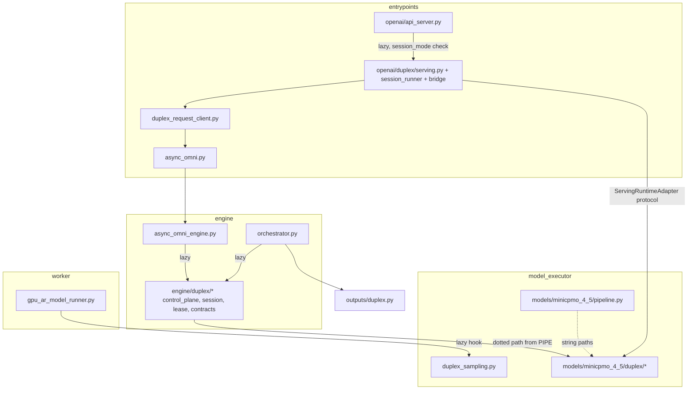
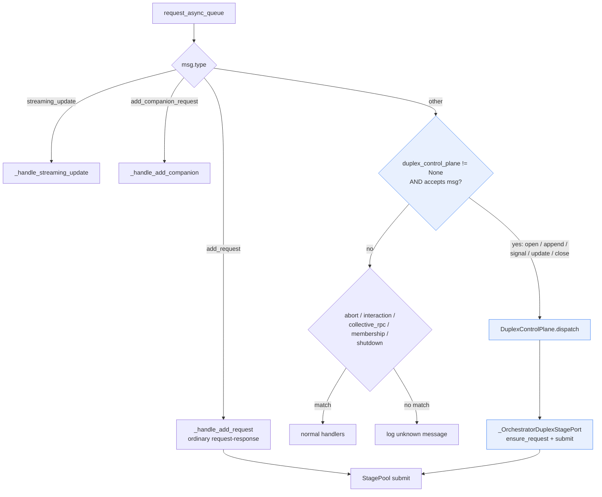
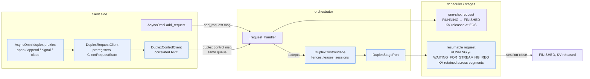
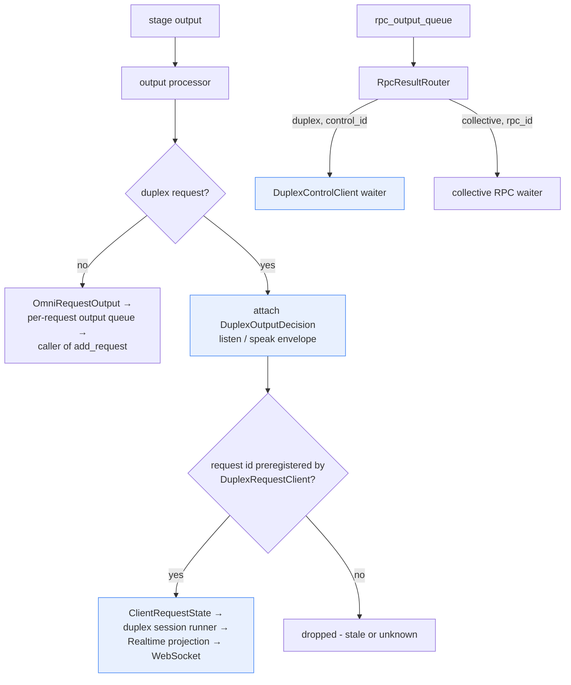

# Full-Duplex Graduation: Moving `experimental/fullduplex` into the Stable Tree

Mission: move all full-duplex code out of `vllm_omni/experimental/fullduplex/`
into the regular (non-experimental) packages. `joyvl/` is out of scope and
stays where it is, together with the `core/` scaffold it depends on.

Decisions already made:

- Model adapter code goes to `vllm_omni/model_executor/models/minicpmo_4_5/duplex/`.
- Clean break: no compat shims at the old import paths; update all in-repo references.
- Tests are relocated to mirror the new layout in the same effort.
- New subpackages are named `duplex` (matches `DuplexSession`, `DuplexControlPlane`,
  `duplex_control_enabled`, and the RFC's `serving_duplex` naming).

## 1. Current state

- ~17k lines in `vllm_omni/experimental/fullduplex/`:
  - `engine/` — control plane, session transactions, leases, contracts, messages.
  - `openai/` — WebSocket actor, Realtime projection, serving handler (largest part).
  - `minicpmo45/` — MiniCPM-o 4.5 model adapter (policy, stage0, data plane).
  - `core/` — small generic scaffold; used only by `joyvl/` → stays.
  - Top-level: `client.py` (demo WS client), `request_client.py`,
    `output.py`, `model_executor.py`.
- Stable modules (`engine/orchestrator.py`, `engine/async_omni_engine.py`,
  `entrypoints/async_omni.py`, `entrypoints/openai/api_server.py`,
  `worker/gpu_ar_model_runner.py`, `model_executor/stage_input_processors/minicpmo_4_5_omni.py`)
  already import the duplex modules **lazily**, inside duplex-only call paths.
- Exception: the MiniCPM model files (`minicpmo_4_5_omni.py`,
  `minicpmo_4_5_omni_tts.py`) import duplex modules **eagerly** at module
  level (`MiniCPMO45DuplexPolicy`, `DuplexSamplingRow`, `get_tts_handoff`).
  Acceptable — those files load only when the MiniCPM model is served — but
  it means the moved `duplex_sampling.py` and `engine/duplex/intermediate.py`
  load with the model even in non-duplex chat mode. Keep as-is.
- `models/minicpmo_4_5/pipeline.py` selects the runtime extension and serving
  adapter via **dotted string paths** pointing at the experimental package.
- CI path filters (`.buildkite/cuda/test-ready.yml`, `test-merge.yml`) and one
  demo (`examples/online_serving/minicpmo/realtime_duplex_demo.py`) reference
  the experimental path.

## 2. Target layout

Origin paths (`← ...`) are relative to `vllm_omni/experimental/fullduplex/`.

```text
vllm_omni/
├── engine/
│   └── duplex/                      # NEW
│       ├── __init__.py              # ← engine/__init__.py (docstring only)
│       ├── contracts.py             # ← engine/contracts.py — immutable DTOs, extension/stage protocols
│       ├── messages.py              # ← engine/messages.py — DuplexFence, control envelopes
│       ├── lease.py                 # ← engine/lease.py — lease activity, TTL/grace, expiry
│       ├── session.py               # ← engine/duplex_session.py — fences, reservations
│       ├── control_plane.py         # ← engine/duplex_control_plane.py
│       ├── control_client.py        # ← engine/duplex_control_client.py
│       ├── runtime.py               # ← engine/duplex_runtime.py — extension load/validate
│       └── intermediate.py          # ← engine/intermediate.py — stage-transfer schema
│
├── outputs/
│   └── duplex.py                    # ← output.py — attach/get DuplexOutputDecision
│
├── model_executor/
│   ├── duplex_sampling.py           # ← model_executor.py — DuplexSamplingHelper/Row for AR runner hook
│   └── models/minicpmo_4_5/
│       └── duplex/                  # NEW
│           ├── __init__.py          # ← minicpmo45/__init__.py (keep 5 re-exports)
│           ├── adapter.py           # ← minicpmo45/adapter.py — MiniCPMO45NativeDuplexServingAdapter
│           ├── policy.py            # ← minicpmo45/policy.py — listen/speak token policy
│           ├── input.py             # ← minicpmo45/input.py — PCM framing, ref-audio decode
│           ├── session.py           # ← minicpmo45/session.py — MiniCPMO45ServingSessionState
│           ├── serving_adapter.py   # ← minicpmo45/serving_adapter.py — MiniCPMO45ServingRuntimeAdapter
│           ├── data_plane.py        # ← minicpmo45/data_plane.py — data-plane projection
│           ├── stage0.py            # ← minicpmo45/stage0.py — Stage0 conversation state
│           ├── runtime.py           # ← minicpmo45/runtime.py — MiniCPMO45DuplexRuntimeExtension
│           └── compat.py            # ← minicpmo45/compat.py — HF remote-config patching
│
├── entrypoints/
│   ├── duplex_request_client.py     # ← request_client.py — beside client_request_state.py it uses
│   └── openai/
│       └── duplex/                  # NEW
│           ├── __init__.py          # ← openai/__init__.py (keep DuplexWebSocketActor re-export; must NOT import client.py)
│           ├── serving.py           # ← openai/serving.py — OmniDuplexSessionHandler
│           ├── session_runner.py    # ← openai/session_runner.py — DuplexSessionRunnerMixin, actor loop
│           ├── runtime_bridge.py    # ← openai/runtime_bridge.py — NativeRuntimeBridgeMixin
│           ├── runtime_adapter.py   # ← openai/runtime_adapter.py — model-neutral ServingRuntimeAdapter protocol
│           ├── session_attachment.py# ← openai/session_attachment.py — resume/takeover registry
│           ├── websocket.py         # ← openai/websocket.py — DuplexWebSocketActor (mailbox + writer)
│           ├── protocol.py          # ← openai/protocol.py — DuplexSession aggregate + wire types
│           ├── realtime_session.py  # ← openai/realtime_session.py — NativeRealtimeSessionProtocol
│           ├── realtime_input.py    # ← openai/realtime_input.py
│           ├── realtime_output.py   # ← openai/realtime_output.py
│           ├── realtime_state.py    # ← openai/realtime_state.py
│           ├── audio.py             # ← openai/audio.py — PCM/WAV codecs
│           ├── chat_fallback.py     # ← openai/chat_fallback.py
│           ├── commit_policy.py     # ← openai/commit_policy.py
│           └── client.py            # ← client.py (top level) — demo/e2e WS client
│
└── experimental/
    └── fullduplex/                  # REMAINS: joyvl only
        ├── README.md                # trimmed to joyvl scope
        ├── __init__.py              # core re-exports (unchanged, joyvl compat)
        ├── core/                    # stays — joyvl depends on it
        └── joyvl/                   # untouched
```

File count check: the experimental package (excluding `core/`, `joyvl/`,
`README.md`, `DESIGN.md`, and the top-level `__init__.py`) holds
9 engine + 15 openai + 10 minicpmo45 + 4 top-level modules = 38 files;
every one is mapped above. The top-level `__init__.py` stays behind — its
`core` re-exports are joyvl-scope; `DESIGN.md` → `docs/design/fullduplex.md`.

- `DESIGN.md` moves to `docs/design/fullduplex.md` (`docs/design/` already
  exists), with module paths updated.
- Package `__init__.py` re-exports must carry over verbatim: the minicpmo45
  package re-exports 5 symbols (`MiniCPMO45DuplexPolicy`,
  `MiniCPMO45NativeDuplexServingAdapter`, `MiniCPMO45ClientRuntimeConfigError`,
  `MiniCPMO45PcmAppendBuffer`, `MiniCPMO45Stage0DuplexRuntime`) that
  `tests/entrypoints/openai_api/test_duplex_handler.py` imports at package
  level; the openai package re-exports `DuplexWebSocketActor`.
- The new `entrypoints/openai/duplex/__init__.py` must **not** import
  `client.py`: it raises `SystemExit` at import time when the optional
  `websockets` dependency is missing (it is a demo/e2e helper only).
- Packaging needs no change: `pyproject.toml` uses
  `include = ["vllm_omni*"]`, which covers the new subpackages.

## 3. Layering after the move



- Import rules preserved from the experimental design:
  - Ordinary (non-duplex) deployments must **not** import any `duplex`
    subpackage at startup. All existing lazy imports stay lazy; only the
    dotted paths change.
  - Generic serving (`serving.py`, `runtime_bridge.py`, `session_runner.py`)
    must not import MiniCPM modules; the model is selected only via
    `PipelineConfig.duplex_serving_adapter` / `duplex_runtime_extension`
    string paths. Import-boundary tests keep enforcing this.
  - `models/minicpmo_4_5/duplex/` importing the `ServingRuntimeAdapter`
    protocol from `entrypoints/openai/duplex/runtime_adapter.py` is the
    normal plugin-implements-host-interface direction and stays.

## 4. Active runtime path (unchanged behavior, new module homes)


## 5. Reference-update matrix

| File | Change |
| --- | --- |
| `engine/orchestrator.py` | lazy imports → `vllm_omni.engine.duplex.{contracts,session,messages,control_plane,lease}`; `vllm_omni.outputs.duplex` |
| `engine/async_omni_engine.py` | lazy imports → `vllm_omni.engine.duplex.{control_client,lease,messages,runtime}` |
| `entrypoints/async_omni.py` | lazy imports → `vllm_omni.entrypoints.duplex_request_client`, `vllm_omni.engine.duplex.{lease,messages}` |
| `entrypoints/openai/api_server.py` | lazy import of duplex handler → `vllm_omni.entrypoints.openai.duplex.serving` |
| `worker/gpu_ar_model_runner.py` | lazy import → `vllm_omni.model_executor.duplex_sampling` |
| `model_executor/stage_input_processors/minicpmo_4_5_omni.py` | → `vllm_omni.engine.duplex.intermediate`, `...models.minicpmo_4_5.duplex.input` |
| `model_executor/models/minicpmo_4_5/pipeline.py` | dotted strings → `vllm_omni.model_executor.models.minicpmo_4_5.duplex.runtime.MiniCPMO45DuplexRuntimeExtension`, `...duplex.serving_adapter.MiniCPMO45ServingRuntimeAdapter` |
| `model_executor/models/minicpmo_4_5/*.py` (3 model files) | import path updates |
| `examples/online_serving/minicpmo/realtime_duplex_demo.py` | → `vllm_omni.entrypoints.openai.duplex.client` |
| `tests/e2e/online_serving/minicpmo_realtime_duplex_scenarios.py` | → `vllm_omni.entrypoints.openai.duplex.client` |
| `.buildkite/cuda/test-ready.yml`, `test-merge.yml` | in the "MiniCPM-o 4.5 Duplex Test" blocks, replace `vllm_omni/experimental/fullduplex/` with 3 dirs (`engine/duplex/`, `entrypoints/openai/duplex/`, `model_executor/models/minicpmo_4_5/duplex/`) + 3 files (`outputs/duplex.py`, `entrypoints/duplex_request_client.py`, `model_executor/duplex_sampling.py`) + new test dirs |
| `pyproject.toml` | lint-ignore line is joyvl-only → unchanged |
| `experimental/fullduplex/README.md` | trim to joyvl/core scope |
| `DESIGN.md` | relocate, update module tables (kernel/experimental split section rewritten as kernel/duplex split) |

## 6. Test relocation

| From `tests/e2e/features/fullduplex/` | To |
| --- | --- |
| `engine/` — 6 files: `test_duplex_control_client.py`, `test_duplex_control_plane.py`, `test_duplex_deploy_config.py`, `test_duplex_intermediate.py`, `test_duplex_lease.py`, `test_duplex_runtime.py` | `tests/engine/duplex/` |
| `openai/` — 3 files: `test_duplex_audio.py`, `test_websocket_actor.py`, `test_runtime_adapter_boundary.py` | `tests/entrypoints/openai/duplex/` |
| `minicpmo45/` — 2 files: `test_commit_policy.py`, `test_input.py` | `tests/model_executor/models/minicpmo_4_5/duplex/` |
| `test_client.py` | `tests/entrypoints/openai/duplex/` |
| `test_runtime.py` (covers `core/` + joyvl adapter), `test_joyvl_*.py` | stay (joyvl/core scope) |

- Tests already in stable locations (`tests/engine/test_duplex_import_boundary.py`,
  `tests/entrypoints/...`, `tests/worker/test_native_duplex_hooks.py`,
  `tests/e2e/online_serving/test_minicpmo_4_5_duplex.py`) only get import updates.
- `test_duplex_import_boundary.py` is updated to assert that importing
  `Orchestrator` / `AsyncOmniEngine` / `AsyncOmni` / the API server for an
  ordinary deployment does **not** load any of:
  `vllm_omni.engine.duplex`, `vllm_omni.entrypoints.openai.duplex`,
  `vllm_omni.model_executor.models.minicpmo_4_5.duplex`.
- `__init__.py` convention per target: `tests/engine/` and
  `tests/model_executor/models/minicpmo_4_5/` use `__init__.py` → new `duplex/`
  subdirs get one; `tests/entrypoints/openai/` has none → follow suit.
- Fixture safety: only `tests/conftest.py` exists on the ancestry path (no
  conftest under `tests/e2e/` or `tests/e2e/features/`), so relocated tests
  lose no fixtures.
- **CI tier check** (verified during execution): the moved tests are marked
  `core_model and cpu`. After the move, engine + openai tests are picked up by
  the "Simple · Engine&Entrypoints Test" CPU block
  (`pytest tests/entrypoints tests/engine`), and the two minicpmo45 tests are
  picked up by the "Simple · Model Executor Test" CPU block
  (`pytest tests/model_executor`) that exists in both `test-ready.yml` and
  `test-merge.yml`. No CI command change is needed; confirm with
  `pytest --collect-only -m 'core_model and cpu'` on the three new dirs.
- `docs/contributing/ci/test_writing_guide.md` / `test_system_overview.md`
  cite `tests/e2e/features/fullduplex/` as a feature-dir example — still valid
  after the move (the dir survives holding joyvl tests); no doc change required.

## 7. Migration order (each step leaves the tree importable and testable)

1. **Engine kernel**: move `engine/` → `engine/duplex/` (with the
   `duplex_` prefix dropped from module names); move `output.py` →
   `outputs/duplex.py`; update `orchestrator.py`, `async_omni_engine.py`
   lazy imports; update engine tests.
2. **Entrypoint plumbing**: move `request_client.py` →
   `entrypoints/duplex_request_client.py`; `model_executor.py` →
   `model_executor/duplex_sampling.py`; update `async_omni.py`,
   `gpu_ar_model_runner.py`; update their tests.
3. **Serving stack**: move `openai/` → `entrypoints/openai/duplex/`
   (plus `client.py`); update `api_server.py` handler import and demo script;
   update serving/protocol/handler tests.
4. **Model adapter**: move `minicpmo45/` →
   `models/minicpmo_4_5/duplex/`; update `pipeline.py` dotted strings,
   `stage_input_processors/minicpmo_4_5_omni.py`, model files; update
   minicpmo tests and the import-boundary test.
5. **Cleanup**: relocate remaining tests, update `.buildkite` path filters,
   trim experimental `README.md`, relocate `DESIGN.md`, delete the emptied
   experimental modules; grep-verify no `experimental.fullduplex` reference
   remains outside `joyvl`/`core` and their docs/scripts.

## 8. Invariants that must survive the move

- Lazy-import boundary: ordinary startup imports zero duplex modules
  (guarded by the updated import-boundary test).
- No behavior change: this is a pure relocation — no renamed public symbols,
  no logic edits, no new abstractions.
- `duplex_` prefix dropped only where the package name already carries it
  (`engine/duplex/session.py`, not `engine/duplex/duplex_session.py`);
  class names (`DuplexSession`, `DuplexControlPlane`, ...) are unchanged.
- Fence/lease/append transactional contracts, Realtime event contract, and
  the two-session admission behavior documented in `DESIGN.md` are untouched.
- `joyvl/` + `core/` remain importable at their current experimental paths.

## 9. Appendix: how the Orchestrator switches between request-response and full-duplex

- There is **one** Orchestrator, one request queue, and one stage machinery.
  Full-duplex is not a second pipeline — it is an optional control plane
  bolted onto the same intake loop and the same `StagePool`s.
- The switch happens at three places:
  1. **Construction** — `enable_duplex_control` (from
     `PipelineConfig.duplex_control_enabled`) decides whether a
     `DuplexControlPlane` exists at all. Ordinary deployments: `None`,
     single fast-path check, no duplex imports.
  2. **Message intake** — `_request_handler()` reads one
     `request_async_queue`; duplex control envelopes are claimed by
     `duplex_control_plane.accepts(msg)` in the same `elif` chain that
     routes ordinary `add_request` / `streaming_update`.
  3. **Output tagging** — duplex outputs get a typed
     `DuplexOutputDecision` attached; client-side routing drops outputs
     that were not preregistered by `DuplexRequestClient`.

### 9.1 Message intake switch (`orchestrator._request_handler`)



- Key point: when the deployment is ordinary, `duplex_control_plane is None`
  and the `accepts()` branch costs one `is not None` check — the duplex path
  is invisible.
- Both paths converge on the **same** `StagePool`; a duplex append becomes a
  *resumable* scheduler request instead of a one-shot one.

### 9.2 The two request lifecycles on shared stage machinery



- Ordinary path: request enters, runs to EOS, KV freed — identity is the
  request.
- Duplex path: `open` reserves the Stage0 request resource transactionally;
  each `append` wakes the parked resumable request (prepare/submit/commit
  with fence validation); segment stop parks it again with KV retained;
  only `close` (or lease expiry via the reaper loop) finishes it — identity
  is the session.
- Cancellation (barge-in) does not use the ordinary `abort` handler: it is a
  duplex control message that advances the session fence atomically, so a
  stale append with the old fence is rejected forever.

### 9.3 Output-side routing



- Control results and data outputs travel on different channels: control
  acknowledgements come back through the single `RpcResultRouter` keyed by
  `("duplex", control_id)`; model outputs flow through the ordinary output
  processor, distinguished only by the typed decision envelope and the
  preregistered request identity.
- After the migration these boxes map to: `DuplexControlPlane` / port →
  `engine/duplex/control_plane.py`, control client → `engine/duplex/control_client.py`,
  request client → `entrypoints/duplex_request_client.py`, decision tagging →
  `outputs/duplex.py`, session runner → `entrypoints/openai/duplex/`.

## 10. Known risks

- Two `DuplexSession` classes exist (engine transaction state in
  `engine/duplex/session.py` vs serving aggregate in
  `entrypoints/openai/duplex/protocol.py`). They already coexist under
  different modules; keep both names, rely on module paths — no rename in
  this mission.
- Dotted-string paths (`pipeline.py`, deploy profiles, any user-supplied
  `duplex_serving_adapter`) fail at runtime, not import time — step 4 must
  include a startup smoke test of the MiniCPM pipeline config resolution.
- H20-validated tree: DESIGN.md ties validation evidence to exact file paths;
  the relocation invalidates none of the runtime evidence but the doc must
  state the tree moved after validation.

## 11. Execution log (deviations found while executing and reviewing the move)

- `DUPLEX_OUTPUT_DECISION_KEY` in `outputs/duplex.py` changed value from
  `"_vllm_omni.experimental.fullduplex.duplex_output_decision"` to
  `"_vllm_omni.duplex.duplex_output_decision"`. Both producer and consumers
  read the constant, so this is safe within one tree, but it is a wire-key
  change: a mixed old/new deployment would not match keys. Not a concern for
  an atomic in-repo migration.
- `tests/entrypoints/openai/duplex/test_runtime_adapter_boundary.py` used
  `Path(__file__).resolve().parents[3]` as subprocess cwd; relocation changed
  the directory depth. Fixed to `parents[4]` (true repo root, matching
  `test_duplex_import_boundary.py`). Lesson: `__file__`-relative paths are a
  relocation hazard the original design review missed; all moved files were
  swept for `__file__` and this was the only hit.
- The section 6 "CI tier trap" was wrong: both Buildkite files contain a
  "Simple · Model Executor Test" CPU block that picks up the relocated
  minicpmo45 tests. No CI command change was made; only the duplex
  source-filter list was replaced.
- `ruff check --fix` re-sorted 20 import blocks whose group order changed with
  the new paths, and `ruff format` re-wrapped `pipeline.py`'s
  `duplex_runtime_extension` string onto its own line. A line-level diff audit
  confirmed no other content changed beyond path rewrites and the manual
  edits listed here and in sections 5–6.
- Runtime validation (pytest, imports) could not run on the migration machine
  (no torch/vllm). Static verification passed: 77 files byte-compile, all 344
  `vllm_omni.*` imports in changed files resolve, ruff clean, CI YAML parses.
  The focused suites and import-boundary tests still need a GPU/H20 run
  before publishing.
